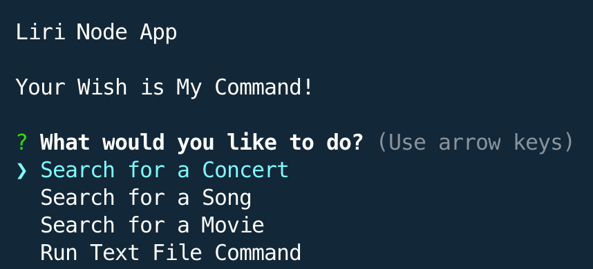
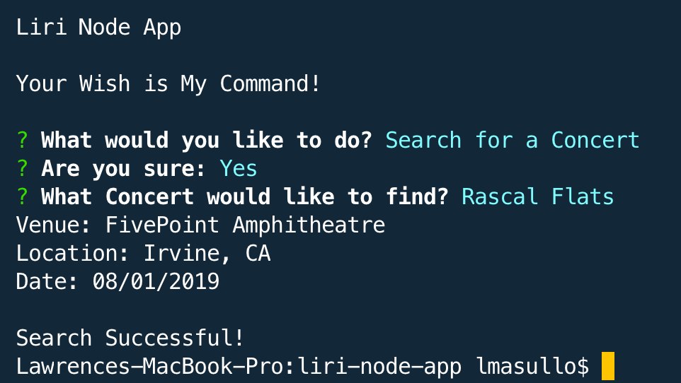

# Project Title

Include screenshots, gifs or videos of the app functioning
Contain a link to a deployed version of the app

Liri Node App

## Description:

Did you ever want to know when your favorite band is coming to town, or information about a song or movie?
Your wish is my command!
The Liri Node App will take your input, do the search, and produce the desired results.

### Installing

* Clone this repository
* Run npm init -y
* Run npm install

## Built With

Javascript
Node.js

LIRI will search Spotify for songs, Bands in Town for concerts, and OMDB for movies.
The app uses the following NPM packages: 

### NPM Packages
* Dotenv - keep the keys safe
* Inquirer - provides the menu system
* Axios - used to nake the http requests
* Spotify - music API
* Moment - date formatter
* Fs - node file system to read and write to the text files

## Instructions

* Start the program by running 'node liri.js' in the terminal
* You will be presented with this menu:

* Use your arrow key to make a choice and press 'Enter'
* You will be given a confirmation message, press 'Enter' if you want to continue
* Enter the Search Term and press 'Enter'
* You will be presented with the search results:

* You have your choice to search for a concert, song, or a movie.
* The last choice in the menu "Run Text File Command' will read the random.tx file and execute the enclosed command.
* All of the search results are saved in the log.txt file

## Demo (Click the Image to View the Demo Video)

## Versioning

We use [SemVer](http://semver.org/) for versioning. 
Current version is 1.0

## Authors

* **Larry Masullo (sole author)**

## License

This project is licensed under the MIT License - see the [LICENSE.md](LICENSE.md) file for details

## Acknowledgments

* Thanks to the Instructors and Teaching Assistants in the UT Full Stack Coding Bootcamp for their support. 
